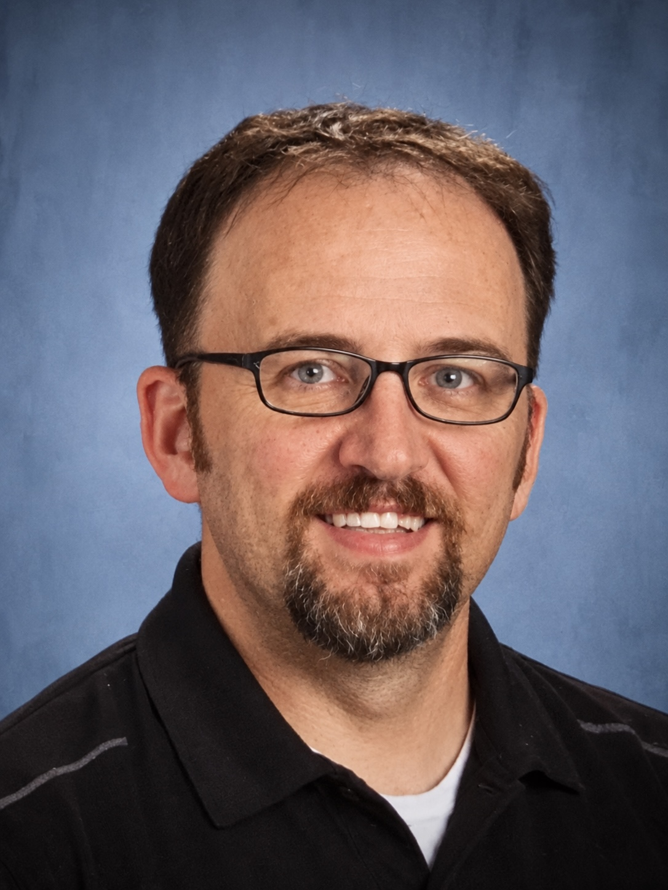
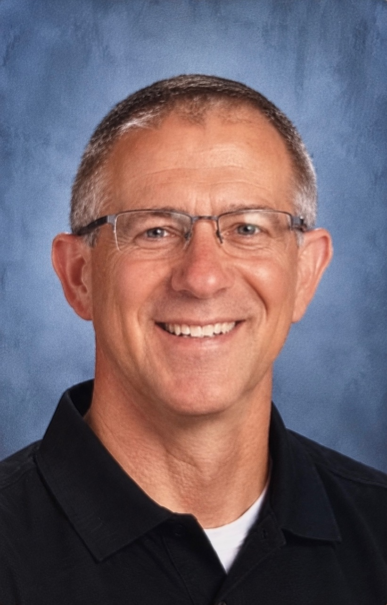
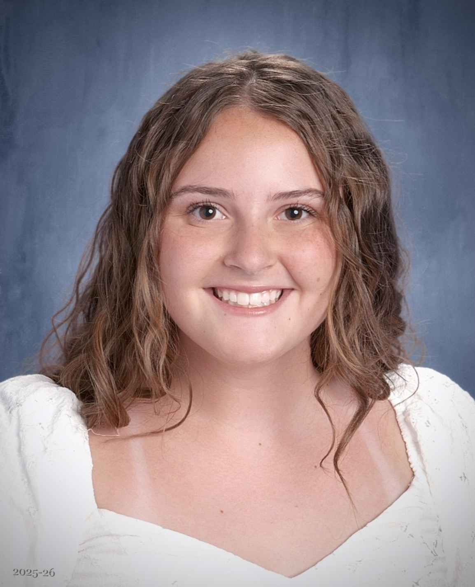
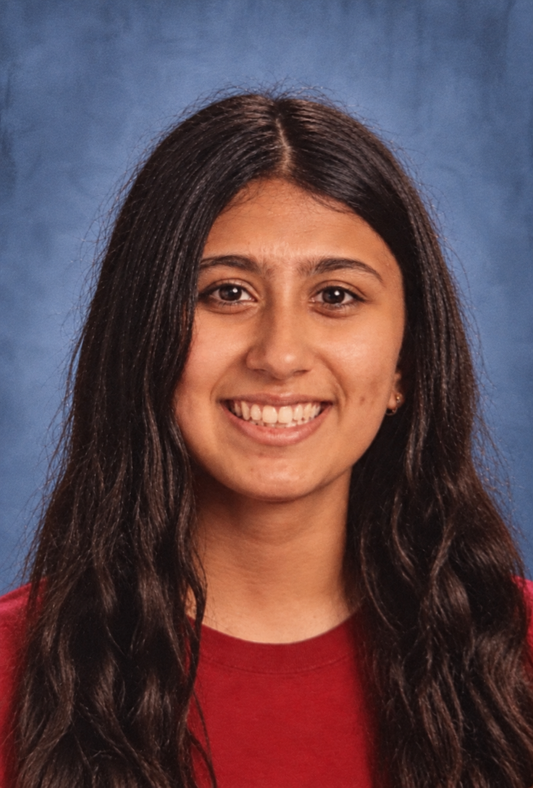
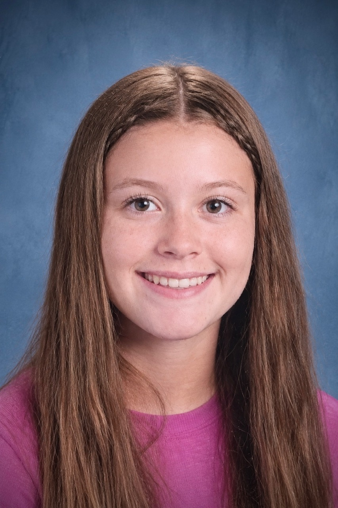

## Overview

Science Olympiad is a national STEM competition where teams of up to
15 students compete in ~23 events spanning biology, chemistry, physics,
earth science, and engineering. Central York fields a team each year
that competes at the regional level, with the goal of advancing to
states.

## Coaches

::: {.grid}

::: {.g-col-12 .g-col-md-4 .team-card}
{.team-photo}

Matthew Hess

Coach

[mhess@cysd.k12.pa.us](mailto:mhess@cysd.k12.pa.us)
:::

::: {.g-col-12 .g-col-md-4 .team-card}
{.team-photo}

Eric Musselman

Coach

[emusselman@cysd.k12.pa.us](mailto:emusselman@cysd.k12.pa.us)
:::

:::

## Officers

::: {.grid}

::: {.g-col-12 .g-col-md-4 .team-card}
{.team-photo}

Abigail Zayatz

:::

::: {.g-col-12 .g-col-md-4 .team-card}
{.team-photo}

Prisha Patel

:::

::: {.g-col-12 .g-col-md-4 .team-card}
{.team-photo}

Sarah Crowell

:::

:::

## Divisions

Central York competes in **Division C** (grades 9–12) and **Division B** (grades 6-8).

## Events We Compete In

::: {.grid}
::: {.g-col-6}
**Life, Personal & Social Science**

- Anatomy & Physiology
- Botany
- Disease Detectives
- Ecology
- Water Quality
:::
::: {.g-col-6}
**Physical Science & Chemistry**

- Chemistry Lab
- Circuit Lab
- Forensics
- Hovercraft
- Protein Modeling
- Thermodynamics
:::
::: {.g-col-6}
**Earth & Space Science**

- Astronomy
- Dynamic Planet
- Remote Sensing
- Rocks and Minerals
:::
::: {.g-col-6}
**Technology & Engineering**

- Boomilever
- Electric Vehicle
- Mission Possible
- Wright Stuff
:::
::: {.g-col-6}
**Inquiry & Nature of Science**

- Codebusters
- Engineering CAD
- Experimental Design
- Ping Pong Parachute
:::

:::